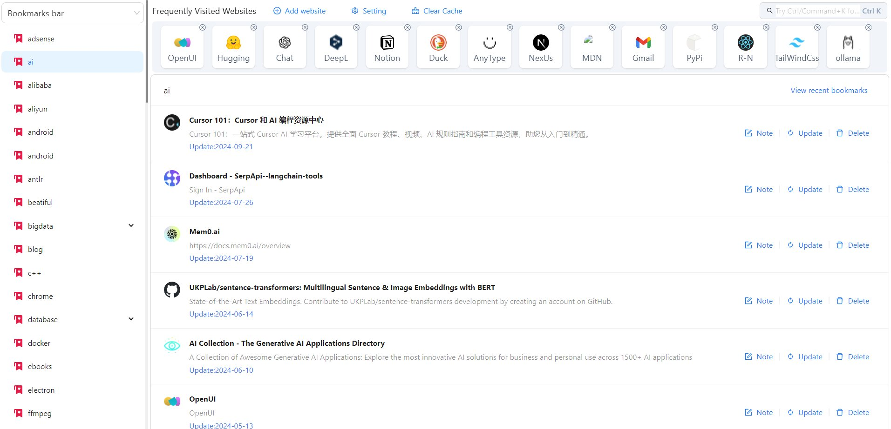

# Simple Smart Bookmarks

[](https://chrome.google.com/webstore/detail/simple-smart-bookmarks/impcoboflplckeecdbidgloeklconkdb?hl=en-US&utm_source=ext_sidebar)

[English](./README.md)|[中文](./README_zh.md)

## Acknowledgements

This project was built with the help of the [Plasmo framework](https://www.plasmo.com/), which provides a comprehensive and developer-friendly solution for building modern browser extensions.

---

**Simple Smart Bookmarks** is a browser extension that enhances your browsing experience by allowing you to manage and organize your bookmarks in a streamlined, intuitive way.



## Features

- **Quick Access to Bookmarks**: Access all your bookmarks easily from the browser toolbar.
- **Smart Search**: Type to quickly find the bookmarks you're looking for.
- **Categorize and Group**: Organize your bookmarks by tags or categories for quicker navigation.
- **Clean Interface**: The extension provides a minimalistic and easy-to-use UI, keeping everything simple and fast.
- **Manage Bookmarks Easily**: Add, edit, or delete bookmarks directly through the extension.

## Usage

You can install Simple Smart Bookmarks from the [Chrome Web Store](https://chrome.google.com/webstore/detail/simple-smart-bookmarks/impcoboflplckeecdbidgloeklconkdb?hl=en-US&utm_source=ext_sidebar).

1. Go to the [Chrome Web Store](https://chrome.google.com/webstore/detail/simple-smart-bookmarks/impcoboflplckeecdbidgloeklconkdb?hl=en-US&utm_source=ext_sidebar).
2. Click on "Add to Chrome".
3. Confirm by clicking "Add Extension".

## Installation 

1. Clone the repository:

    ```bash
    git clone https://github.com/Byte-Biscuit/simple-smart-bookmarks.git
    ```

2. Navigate to the project directory:

    ```bash
    cd simple-smart-bookmarks
    ```

3. Install dependencies:

    ```bash
    npm install
    ```

4. After installation, run the following command to start the application:

    ```bash
    npm run dev
    ```

5. A `./build/chrome-mv3-dev` plugin directory will be generated under the current project folder. You can load the plugin through the browser's [Extensions](chrome://extensions/) page. Make sure to enable the Developer Mode in your browser beforehand.

6. Use the following command to generate the production environment, which can be published to the Google Chrome Web Store.

    ```bash
    npm run build
    ```

## Contributing

Contributions are welcome! If you'd like to contribute to improving the extension, feel free to open an issue or submit a pull request.

1. Fork this repository.
2. Create your feature branch (`git checkout -b feature/new-feature`).
3. Commit your changes (`git commit -am 'Add new feature'`).
4. Push to the branch (`git push origin feature/new-feature`).
5. Create a new pull request.

## License

This project is licensed under the Apache License. See the [LICENSE](./LICENSE) file for more details.

---

### [Install Simple Smart Bookmarks Now](https://chrome.google.com/webstore/detail/simple-smart-bookmarks/impcoboflplckeecdbidgloeklconkdb?hl=en-US&utm_source=ext_sidebar)

