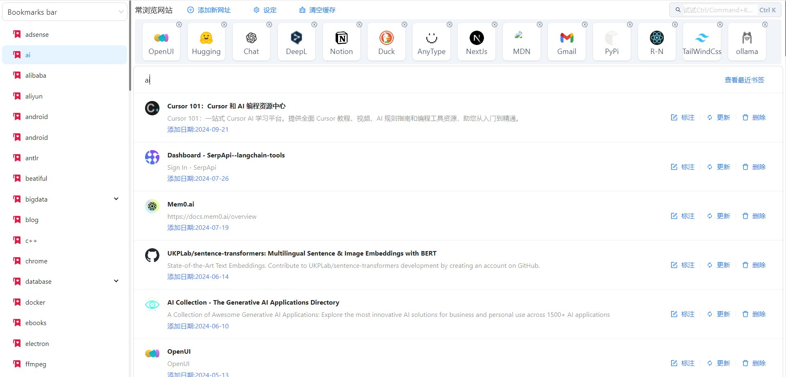

# 简便书签

[](https://chrome.google.com/webstore/detail/simple-smart-bookmarks/impcoboflplckeecdbidgloeklconkdb?hl=en-US&utm_source=ext_sidebar)

[English](./README.md)|[中文](./README_zh.md)

## 致谢

本项目得益于 [Plasmo 框架](https://www.plasmo.com/) 的帮助，该框架为构建现代浏览器扩展提供了全面且开发者友好的解决方案。

---

**简便书签** 是一个浏览器扩展，帮助你通过简洁、直观的方式管理和组织书签，提升你的浏览体验。



## 功能

- **快速访问书签**：可以通过浏览器工具栏轻松访问所有书签。
- **智能搜索**：输入关键词即可快速找到你需要的书签。
- **分类和分组**：通过标签或类别对书签进行组织，方便快速导航。
- **简洁界面**：提供简约易用的界面设计，保持一切简单且快速。
- **轻松管理书签**：可以通过扩展直接添加、编辑或删除书签。

## 使用方法

你可以通过 [Chrome 网上应用店](https://chrome.google.com/webstore/detail/simple-smart-bookmarks/impcoboflplckeecdbidgloeklconkdb?hl=en-US&utm_source=ext_sidebar) 安装简单智能书签。

1. 打开 [Chrome 网上应用店](https://chrome.google.com/webstore/detail/simple-smart-bookmarks/impcoboflplckeecdbidgloeklconkdb?hl=en-US&utm_source=ext_sidebar)。
2. 点击“添加至 Chrome”。
3. 确认并点击“添加扩展程序”。

## 安装步骤

1. 克隆此仓库：

    ```bash
    git clone https://github.com/Byte-Biscuit/simple-smart-bookmarks.git
    ```

2. 进入项目目录：

    ```bash
    cd simple-smart-bookmarks
    ```

3. 安装依赖项：

    ```bash
    npm install
    ```

4. 安装完成后，运行以下命令启动应用：

    ```bash
    npm run dev
    ```

5. 在当前项目目录下生成 `./build/chrome-mv3-dev` 插件目录。你可以通过浏览器的 [扩展程序页面](chrome://extensions/) 加载该插件。请确保先在浏览器中启用开发者模式。

6. 使用以下命令生成生产环境版本，可以发布到谷歌浏览器插件市场：

    ```bash
    npm run build
    ```

## 贡献

欢迎贡献！如果你希望改进该扩展，请随时提交问题或发起拉取请求。

1. Fork 此仓库。
2. 创建你的功能分支 (`git checkout -b feature/new-feature`)。
3. 提交你的更改 (`git commit -am 'Add new feature'`)。
4. 推送到分支 (`git push origin feature/new-feature`)。
5. 发起一个新的拉取请求。

## 许可证

本项目基于 Apache 许可证开源。详细信息请参阅 [LICENSE](./LICENSE) 文件。

---

### [立即安装简便书签](https://chrome.google.com/webstore/detail/simple-smart-bookmarks/impcoboflplckeecdbidgloeklconkdb?hl=en-US&utm_source=ext_sidebar)
